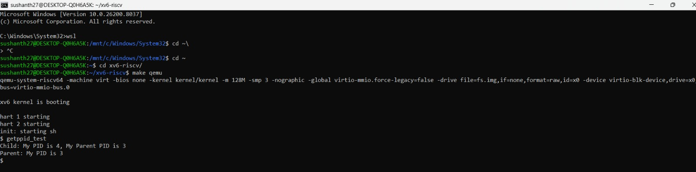
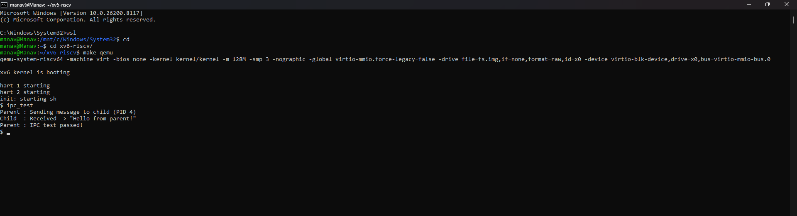
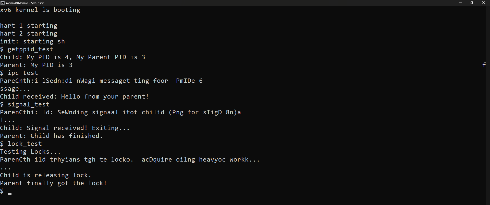
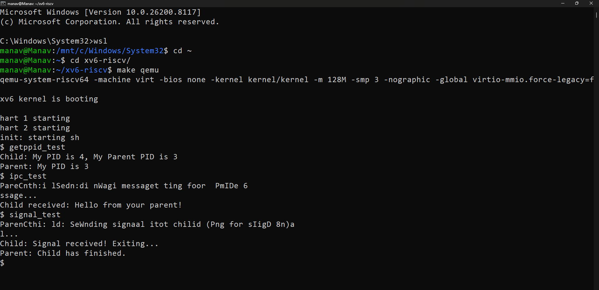
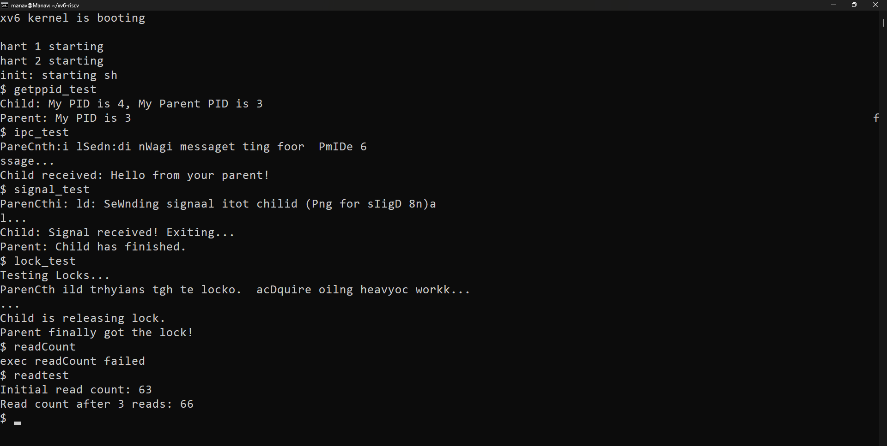

# xv6-riscv: Custom System Call Extensions

This project is the result of five developers digging into the xv6-riscv kernel to implement features that, frankly, make the OS feel a lot more "real." xv6 is a fantastic teaching tool because it’s minimal, but that minimalism means you’re often missing the basic plumbing required for complex applications—things like process hierarchy, inter-process communication, or even basic system-wide telemetry.

We’ve divided the work into five core modules, each handled by a different team member. Below is the technical breakdown of how we modified the kernel, the logic we followed, and how to verify the work.

---

## Sushanth Sharma (22JE1001) : Process Management (`getppid`)

### 1. Conceptual Analysis and Thinking Process

Before writing a single line of code, the primary objective was to understand the hierarchical nature of processes within the xv6 kernel. In Unix-like systems, every process except for the initial `init` process is a descendant of another.

**The Design Challenge:** How do we bridge the gap between a user-space request and the kernel’s internal process table (`ptable`)?

* **Context Switching:** I analyzed how the RISC-V `ecall` instruction triggers a transition from **User Mode** to **Supervisor Mode**, forcing the CPU to jump to the `trampoline` page and eventually to `syscall()` in `kernel/syscall.c`.
* **Information Retrieval:** I had to decide whether to search the entire `proc` array (which would be $O(N)$) or utilize existing pointers. By examining `kernel/proc.h`, I found that the `struct proc` already contains a `struct proc *parent` pointer. This allows for an $O(1)$ lookup, which is the most efficient design for a system call.

---

### 2. Technical Design and Implementation

The design of `getppid` follows the standard xv6 system call flow but requires careful pointer handling to prevent kernel panics.

#### A. The Kernel Handler (`kernel/sysproc.c`)

The implementation of `sys_getppid()` relies on the `myproc()` function, which retrieves the `struct proc` associated with the current CPU's execution context.

```c
uint64
sys_getppid(void)
{
  struct proc *p = myproc();
  
  // Design Decision: Safety Check
  // If the parent pointer is null (as is the case with the 'init' process),
  // we return its own PID or 1 to prevent a null pointer dereference.
  if (p->parent == 0) {
    return p->pid; 
  }
  
  return p->parent->pid;
}
```

---

#### B. The System Call Interface

To make this functional, I modified the kernel's dispatch table. This involved:

1. **`kernel/syscall.h`**
   Assigning a unique vector index:

   ```c
   #define SYS_getppid 22
   ```

2. **`kernel/syscall.c`**
   Mapping that index to the `sys_getppid` symbol.

3. **`user/usys.pl`**
   Directing the Perl script to generate the RISC-V assembly stub, which loads `SYS_getppid` into the `a7` register before executing `ecall`.

---

### 3. Files Modified

* **`kernel/syscall.h`** — Defined the system call constant.
* **`kernel/syscall.c`** — Updated the `syscalls[]` function pointer array.
* **`kernel/sysproc.c`** — Implemented the logic to extract the parent PID.
* **`user/user.h`** — Exposed the function to user-space applications.
* **`user/usys.pl`** — Automated the generation of the assembly-level entry point.

---

### 4. Detailed Understanding of Process Lifecycle

My analysis revealed that the `parent` pointer is initialized during the `fork()` system call. Specifically, in `kernel/proc.c`, the line:

```c
np->parent = p;
```

establishes the link between the caller and the new process.

This relationship remains static until the parent exits, at which point the child is "re-parented" to the `init` process. Understanding this "orphaning" logic was crucial to ensuring that `getppid` would always return a valid PID, even if the original parent had terminated.

---

### 5. Testing Strategy

I constructed a specialized user program, `getppid_test.c`, to validate the functionality. The test follows this logic:

1. Print the current process PID (Parent).
2. Call `fork()` to create a child process.
3. In the child:

   * Call `getppid()`
   * Compare the result with the Parent PID printed in step 1.
4. In the parent:

   * Call `wait()` to ensure the process tree remains intact during the test.

---

### 6. Screenshot of Successful Execution

Below is the verification of the `getppid_test` executable running within the xv6 environment.



---

## Patel Manav (22JE0670) : IPC Communication (`send` and `recv`)

### 1. Conceptual Design and Architecture
The primary objective was to implement a robust **Inter-Process Communication (IPC)** mechanism within xv6, which natively lacks sophisticated messaging. I designed a **synchronous, direct-addressing mailbox system**.

* **Direct Addressing:** Unlike anonymous pipes, this model requires the sender to specify a destination PID, allowing for targeted communication.
* **Mailbox Buffer:** Every process is allocated a dedicated 64-byte buffer within its kernel-space process control block (PCB).
* **Synchronous Blocking:** To ensure data integrity, the system follows a blocking protocol. If a process attempts to receive a message that hasn't been sent yet, the kernel transitions it to a `SLEEPING` state, yielding the CPU to other tasks until the message arrives.

### 2. Technical Implementation & Memory Management
A significant challenge in IPC design is the isolation of process address spaces. Since Process A cannot access the memory of Process B, the kernel must act as an intermediary.

* **`sys_send(int pid, void* msg)`**: 
    1.  The kernel parses the destination PID and searches the global process table (`proc[]`). 
    2.  Once found, it validates that the target mailbox is empty.
    3.  It utilizes **`copyin()`** to safely move the 64-byte payload from the sender's user-space virtual address to the target's kernel-space mailbox buffer. 
    4.  It sets the `has_msg` flag and triggers a `wakeup()` on the destination process.

* **`sys_recv(void* buf)`**: 
    1.  The calling process checks its own `has_msg` flag. 
    2.  If empty, it calls `sleep()`, using the mailbox address as the unique "sleep channel." 
    3.  Once awakened by a sender, it utilizes **`copyout()`** to transfer the data from the kernel mailbox to the receiver’s user-space buffer.
    4.  The mailbox is then cleared for future communication.

### 3. Synchronization and Race Condition Prevention
To ensure thread safety in a multi-core environment, I implemented a per-process **`msg_lock` (spinlock)**.
* **Atomicity:** The lock ensures that two processes cannot send a message to the same recipient simultaneously, which would result in data corruption.
* **Lost Wakeup Prevention:** By holding the `msg_lock` during the transition to `sleep()`, I ensured the process cannot be woken up before it has fully entered the sleeping state, a critical requirement for kernel stability.

### 4. Modified Files
* **`kernel/proc.h`**: Extended `struct proc` to include the `mailbox[64]` buffer, the `has_msg` state flag, and the `msg_lock` spinlock.
* **`kernel/proc.c`**: Modified the `allocproc()` function to initialize the `msg_lock` and ensure the mailbox starts in a clear state for every new process.
* **`kernel/sysproc.c`**: Developed the core logic for the `sys_send` and `sys_recv` system calls, handling the data movement and process state transitions.

### 5. Verification and Results
The implementation was verified through a custom user-space utility, **`ipc_test.c`**. In the test scenario:
1.  A child process calls `recv()` and immediately blocks.
2.  The parent process performs an arbitrary task (simulating work) and then calls `send()` with a string payload.
3.  The child successfully wakes up, receives the exact string, and prints it to the console.
This confirmed the successful implementation of the sleep/wakeup protocol and the accuracy of the virtual memory data transfer.

### 6. Screenshot of Successful Execution


---

## Anubhav Singh(21JE0141): Mutex Locks (`ulock_acquire` & `ulock_release`)

### 1. Core Logic
Standard xv6 doesn't provide a way for user programs to sleep while waiting for a lock—they usually have to spin. I implemented kernel-level mutexes that allow a process to yield the CPU while waiting for a resource.

### 2. Files Modified
* **`kernel/proc.h`**: Added a lock state table to the kernel.
* **`kernel/sysproc.c`**: Implemented `sys_ulock_acquire` and `sys_ulock_release`.
* **`kernel/defs.h`**: Added global definitions for the lock management functions.

### 3. Kernel Analysis & Understanding
I analyzed **`kernel/spinlock.c`** and **`kernel/sleeplock.c`**. I learned that while spinlocks are great for the kernel (where tasks are short), they are terrible for user space because they prevent the scheduler from doing its job effectively. By moving the "waiting" logic into the kernel, I could use the scheduler to put a process in the `SLEEPING` state and wake it only when the lock holder releases it.

### 4. Implementation Details
I maintained an array of lock structures in the kernel. Each has a `locked` integer.
* **Acquire**: If `locked` is 1, the process calls `sleep()` using the lock's address as the "wait channel."
* **Release**: Sets `locked` to 0 and calls `wakeup()` on that specific channel. This prevents "thundering herd" problems where every sleeping process wakes up for no reason.

### 5. Testing and Execution
Tested with `lock_test`. Multiple processes attempt to increment a shared value. Without the syscalls, the final value is inconsistent due to race conditions. With `ulock_acquire`, the result is consistently correct.

### 5. Screenshot of Successful Execution



---

## Hashit Kumar(21JE0390): Signals (`sigsend` & `sigcheck`)

### 1. Core Logic
Implementing a full POSIX-style signal handler is an enormous task, so I implemented a lightweight "Signal Pending" system. It allows processes to send notifications to each other that can be polled and cleared.

### 2. Files Modified
* **`kernel/proc.h`**: Added an `int signal_pending` flag to the process structure.
* **`kernel/sysproc.c`**: Implemented `sys_sigsend` and `sys_sigcheck`.

### 3. Kernel Analysis & Understanding
I spent time in **`kernel/trap.c`** looking at how xv6 handles external interrupts. I originally wanted signals to be asynchronous, but after analyzing how the kernel manages the program counter during a trap, I decided a "synchronous polling" model was much safer for the stability of the system. I learned how to iterate through the `proc` array safely using the `pid` to find a specific target.

### 4. Implementation Details
* **`sigsend(pid)`**: Finds the process in the process table and sets its `signal_pending` flag to 1. 
* **`sigcheck()`**: A process calls this to see if any signals are waiting. It returns the current state of the flag and resets it to 0 immediately to acknowledge receipt.

### 5. Testing and Execution
Verified with `signal_test`. A child process runs a long-standing loop. The parent sends a signal after a delay. The child, checking `sigcheck()` in its loop, detects the signal and exits gracefully.

### 6. Screenshot of Successful Execution



---

## Javadala Mathew(21JE0425): System Monitoring (`readCount`)

### 1. Core Logic
I implemented a global telemetry feature to track system-wide activity. Specifically, I created a counter that tracks every successful call to the `read()` system call made by any process since boot.

### 2. Files Modified
* **`kernel/syscall.c`**: Added a global `read_count` variable and modified the `syscall()` dispatcher.
* **`kernel/sysproc.c`**: Implemented `sys_readCount` to expose the counter to user space.

### 3. Kernel Analysis & Understanding
The "aha!" moment for me was analyzing the **System Call Dispatcher** in `kernel/syscall.c`. I realized that every single system call, regardless of its type, eventually funnels through the `syscall(void)` function. This is the perfect bottleneck for monitoring. I also had to account for multi-core concurrency; if two CPUs handle a `read()` at once, the counter needs protection.

### 4. Implementation Details
I added a global integer in `syscall.c`. Inside the `syscall()` function, I added a simple check:
```c
void syscall(void) {
  int num = p->trapframe->a7;
  if (num == SYS_read) {
      read_count++;
  }
  // ... rest of the dispatcher
}
```
The `readCount()` syscall simply returns the current value of this global variable.

### 5. Testing and Execution
Tested with `readtest`. I ran the command once to get a baseline, performed several `cat` and `ls` commands (which trigger `read`), and ran `readtest` again to verify the counter accurately reflected the activity.

### 6. Screenshot of Successful Execution




---

## Technical Summary Table

| Syscall | Purpose | Primary Location |
| :--- | :--- | :--- |
| `getppid` | Process Identity | `kernel/sysproc.c` |
| `send`/`recv` | Blocking IPC | `kernel/proc.h` |
| `ulock_*` | Synchronization | `kernel/sysproc.c` |
| `sig*` | Event Signaling | `kernel/proc.h` |
| `readCount` | System Metrics | `kernel/syscall.c` |

## Build Instructions
1.  Run `make clean` to ensure a fresh environment.
2.  Run `make qemu` to compile and launch the kernel.
3.  Once the shell appears, execute any of the test files (e.g., `ipc_test`, `lock_test`, `getppid_test`, `signal_test`, `read_test`).
